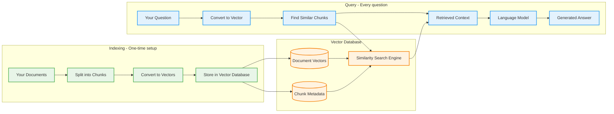

# Code-RAG: Local Retrieval-Augmented Generation

A local RAG (Retrieval-Augmented Generation) system that helps you understand and query your data using locally-run language models through a focused interactive chat interface.

## How RAG Works

**Retrieval-Augmented Generation (RAG)** combines information retrieval with text generation to answer questions using your own documents as context.



### Two-Phase Process

#### **Phase 1: Indexing (Setup)**
1. **Split Documents**: Break your code/docs into manageable chunks
2. **Create Embeddings**: Convert text chunks into numerical vectors (mathematical representations)
3. **Store Vectors**: Save embeddings and metadata in a searchable vector database

#### **Phase 2: Querying (Every Question)**
1. **Embed Question**: Convert your question into the same vector format
2. **Find Similar**: Search database for chunks most similar to your question using vector similarity
3. **Retrieve Context**: Get the most relevant text chunks with their metadata
4. **Generate Answer**: Feed question + context to LLM for a knowledgeable response

### Our System Components

| Component | Purpose | Example |
|-----------|---------|---------|
| **Indexer** | Finds and processes files | `traverse_directory()` |
| **Chunker** | Splits documents intelligently | Smart Markdown chunker for `.md/.pdf` |
| **Embedder** | Converts text to vectors | Sentence Transformers model |
| **Database** | Stores and searches vectors | ChromaDB with similarity search |
| **Generator** | Produces final answers | Ollama local LLM |

### Why This Works

- **Semantic Search**: Finds content by meaning, not just keywords
- **Context-Aware**: LLM gets relevant information to answer accurately
- **Scalable**: Works with large codebases efficiently
- **Local**: Everything runs on your machine - private and fast

## Requirements

- Python 3.8+
- Ollama installed and running locally
- Ensure your environment is configured with the desired embedding model (default is `BAAI/bge-en-icl` as per `.env` file).
  - Note: Some models, like those from JinaAI or Alibaba-NLP (e.g., GTE models), may require `trust_remote_code=True` to load. The system attempts to handle this automatically for known cases. Be aware of the security implications of running remote code.

## Installation

1. Clone this repository:

2. Install dependencies:
```bash
pip install -r requirements.txt
```
   This will install all necessary packages, including `sentence-transformers`, `chromadb`, `ollama`, `python-dotenv`, `pymupdf4llm` (for PDF processing), `einops`, and `sentencepiece`.

3. Make sure you have Ollama installed with the required models:
```bash
ollama pull codellama:7b
```

## Usage

### Indexing Your Codebase

To index your codebase (supports Python, JS, Java, HTML, CSS, MD, TXT, PDF files by default):

```bash
python src/main.py --index /path/to/your/codebase
```

This will:
- Traverse all supported files in the directory
- Split them into meaningful chunks
- Generate embeddings using the configured sentence-transformer model
- Store them in a local ChromaDB database

### Topic-Focused Chat with Your Codebase

Once your codebase is indexed, you can start a focused chat session about a specific topic:

```bash
python src/main.py --query "How does the authentication system work?"
```

This will:
1. Start a chat session focused on your initial query (in this case, authentication)
2. Retrieve relevant code snippets for the initial query only
3. Generate a streaming response using the language model
4. Allow you to ask follow-up questions while maintaining context of the initial topic
5. Follow-up questions will reuse the initially retrieved contexts without performing additional RAG searches

This approach offers several advantages:
- Faster responses for follow-up questions (no repeated retrieval)
- Consistent context throughout the conversation
- Streaming responses for better user experience

The system maintains conversation history to provide continuity while ensuring the discussion stays focused on the original topic.

Type `exit`, `quit`, or press Ctrl+C to end the session.

All configurations (embedding models, LLM models, chunking parameters, database paths, etc.) are managed through the `src/utils/.env` file.

## System Components

- **CodeIndexer**: Handles traversing directories and chunking code files
- **EmbeddingGenerator**: Generates vector embeddings using sentence-transformers (e.g., `BAAI/bge-en-icl`)
- **ChromaDBHandler**: Manages storage and retrieval of code chunks
- **OllamaGenerator**: Handles generation of responses using local LLMs

## Extending the System

- Support additional file types by modifying the `traverse_directory` method in `indexer.py`
- Implement additional chunking strategies based on your specific needs
- Try different embedding models for better code understanding
- Customize prompt templates in the `generator.py` file
