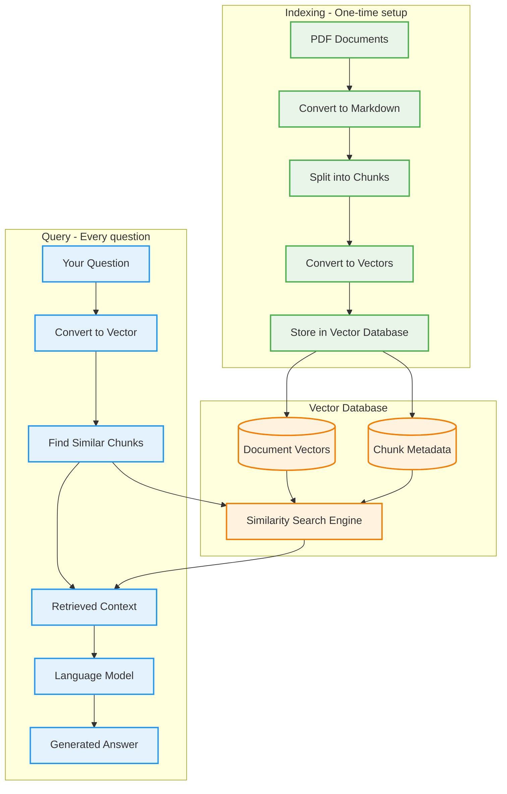

# RAG-Chat: Local Retrieval-Augmented Generation

A local RAG (Retrieval-Augmented Generation) system that helps you understand and query your PDF documents using locally-run language models. Includes both a CLI and a web interface with an inline source viewer.

## How RAG Works

**Retrieval-Augmented Generation (RAG)** combines information retrieval with text generation to answer questions using your own documents as context.


```mermaid
flowchart TD
    subgraph INDEXING ["Indexing - One-time setup"]
        FILES[PDF Documents] --> MD[Convert to Markdown]
        MD --> CHUNK[Split into Chunks]
        CHUNK --> EMBED[Convert to Vectors]
        EMBED --> STORE[Store in Vector Database]
    end

    subgraph QUERY ["Query - Every question"]
        QUESTION[Your Question] --> QEMBED[Convert to Vector]
        QEMBED --> SEARCH[Find Similar Chunks]
        SEARCH --> CONTEXT[Retrieved Context]
        CONTEXT --> LLM[Language Model]
        LLM --> ANSWER[Generated Answer]
    end

    subgraph DATABASE ["Vector Database"]
        VECTORS[(Document Vectors)]
        METADATA[(Chunk Metadata)]
        SIMILARITY[Similarity Search Engine]
    end

    STORE --> VECTORS
    STORE --> METADATA
    VECTORS --> SIMILARITY
    METADATA --> SIMILARITY
    SEARCH --> SIMILARITY
    SIMILARITY --> CONTEXT

    %% Styling
    classDef indexPhase fill:#e8f5e8,stroke:#4caf50,stroke-width:2px
    classDef queryPhase fill:#e3f2fd,stroke:#2196f3,stroke-width:2px
    classDef dbPhase fill:#fff3e0,stroke:#f57c00,stroke-width:2px

    class FILES,MD,CHUNK,EMBED,STORE indexPhase
    class QUESTION,QEMBED,SEARCH,CONTEXT,LLM,ANSWER queryPhase
    class VECTORS,METADATA,SIMILARITY dbPhase
```

### Two-Phase Process

#### **Phase 1: Indexing (Setup)**

1. **Convert PDFs**: PDFs are converted to Markdown via `pymupdf4llm` (preserving tables, structure, etc.)
2. **Split Documents**: Two-stage smart chunking — first split by Markdown headers, then further split at paragraph/sentence boundaries using `langchain-text-splitters`
3. **Create Embeddings**: Convert text chunks into numerical vectors using `qwen3-embedding:latest` via Ollama
4. **Store Vectors**: Save embeddings and metadata in a searchable ChromaDB vector database

#### **Phase 2: Querying (Every Question)**

1. **Embed Question**: Convert your question into the same vector format
2. **Find Similar**: Search database for chunks most similar to your question (over-fetches 3× to allow filtering)
3. **Filter & Rank**: Apply similarity threshold and minimum chunk size filters to keep only high-quality matches
4. **Retrieve Context**: Get the most relevant text chunks with their metadata
5. **Resolve References**: Scan retrieved chunks for cross-references (e.g. "artikel 5", "bijlage A") and fetch the referenced sections
6. **Generate Answer**: Feed question + context to the LLM for a grounded, cited response

### Retrieval Filtering

The system deliberately **over-fetches** candidates from ChromaDB (up to `N_RESULTS × 3`) and then filters them down, so only high-quality context reaches the LLM. You'll see log lines like:

```
Distance stats - Min: 0.381, Max: 0.492, Avg: 0.443, Function: cosine
Filtered 9 results down to 3 high-quality matches
```

**Distance stats** show the raw cosine distances of all initial candidates. Cosine distance ranges from 0 (identical) to 2 (opposite); lower is better. These are converted to a similarity score (1 − distance/2), so a distance of 0.381 ≈ 81% similarity.

**Filtering** then applies two checks to each candidate:

| Filter                   | Setting                              | What it does                                                                                                                                                                             |
| ------------------------ | ------------------------------------ | ---------------------------------------------------------------------------------------------------------------------------------------------------------------------------------------- |
| **Similarity threshold** | `SIMILARITY_THRESHOLD` (default 0.7) | Drops chunks whose similarity score is below this value                                                                                                                                  |
| **Minimum body text**    | `MIN_CHUNK_SIZE` (default 50 chars)  | Drops chunks whose body text (after stripping markdown headers and formatting) is too short — catches header-only chunks like `## 4 Huishoudelijk reglement` that have no actual content |

In the example above, 9 candidates were fetched but only 3 had similarity ≥ 0.7 and length ≥ 50 characters. The remaining 6 were discarded before the LLM ever saw them — reducing noise and lowering hallucination risk.

### System Components

| Component        | Purpose                        | Implementation                                                                         |
| ---------------- | ------------------------------ | -------------------------------------------------------------------------------------- |
| **Indexer**      | Finds and converts PDF files   | `pymupdf4llm` → Markdown with page tracking                                            |
| **Chunker**      | Splits documents intelligently | Two-stage: `MarkdownHeaderTextSplitter` + `RecursiveCharacterTextSplitter` (langchain) |
| **Embedder**     | Converts text to vectors       | `qwen3-embedding:latest` via Ollama                                                    |
| **Database**     | Stores and searches vectors    | ChromaDB with cosine similarity                                                        |
| **Ref Resolver** | Follows cross-references       | Regex extraction + embedding lookup for referenced sections                            |
| **Generator**    | Produces final answers         | `gpt-oss:latest` via Ollama (high reasoning) + hallucination guardrails                |
| **Web UI**       | Browser-based chat + sources   | FastAPI + SSE streaming                                                                |

### Smart Chunking

Documents are split using a two-stage pipeline from [`langchain-text-splitters`](https://python.langchain.com/docs/how_to/split_by_token/):

1. **`MarkdownHeaderTextSplitter`** — splits at `#`, `##`, `###`, and `####` headers, keeping each header attached to its section so chunks never lose their heading context.
2. **Header-only merge** — sections that contain only a header with no meaningful body text (e.g. `## 4 Huishoudelijk reglement` with no following content) are automatically merged into the next section instead of becoming standalone chunks. The body text is evaluated after stripping all markdown formatting (`#`, `**`, `_`, etc.) so formatting-heavy headers can't inflate the character count.
3. **`RecursiveCharacterTextSplitter`** — further splits large sections using a priority hierarchy of separators:
   - `\n\n` (paragraph boundaries)
   - `\n` (line breaks)
   - `. ` / `! ` / `? ` (sentence endings)
   - `; ` / `, ` / ` ` (clauses and words)

This means chunks break at the most meaningful boundary that fits within `CHUNK_SIZE`, and never cut mid-sentence unless a single sentence exceeds the limit. Overlap (`CHUNK_OVERLAP`) ensures continuity between adjacent chunks.

### Appendix / Attachment Protection

Attachments and appendices (e.g. _Bijlage 2 — Bruikleenovereenkomst Notebook_) are treated as **atomic units** and are never split by the chunker. Without this, the header splitter would separate the attachment title from its content, producing a useless chunk like:

> _## Bijlage 2 Bruikleenovereenkomst Notebook_
> _Door ondertekening verklaart werknemer dat …_

…with the actual terms and conditions in a different chunk, losing all context.

The system detects headers matching appendix patterns (`bijlage`, `appendix`, `annex`, `attachment`, `aanhangsel`, `schedule`) and merges them with all subsequent sub-sections until the next top-level or same-level header. The merged appendix chunk is then **excluded** from the recursive text splitter so it stays intact regardless of size.

### Reference Resolution

Legal and HR documents often contain cross-references like _"conform artikel 5.1"_ or _"zie bijlage A"_. When the initial retrieval returns chunks that contain such references, the system automatically:

1. **Extracts** reference phrases using regex patterns for Dutch and English terms (`artikel`, `hoofdstuk`, `bijlage`, `lid`, `paragraaf`, `art.`, `article`, `section`, `chapter`, `appendix`, `clause`, `annex`)
2. **Embeds** each unique reference and queries the vector database for matching chunks
3. **Deduplicates** and appends the referenced chunks to the context sent to the LLM

This ensures the LLM sees both the chunk that _mentions_ a rule and the chunk that _defines_ it. Controlled via `RESOLVE_REFERENCES` in `src/.env`.

### Hallucination Guardrails

The system includes multiple layers of protection against hallucination and inconsistent output:

| Layer                               | Mechanism                                       | Description                                                                                                                         |
| ----------------------------------- | ----------------------------------------------- | ----------------------------------------------------------------------------------------------------------------------------------- |
| **Deterministic generation**        | `temperature=0.0`, fixed `seed=42`              | Eliminates randomness — the same query + context always produces the same answer                                                    |
| **Strict system prompt**            | 7 explicit rules in the system message          | Forbids speculation, demands citations, enforces source-only answers                                                                |
| **Hardened in-prompt instructions** | "STRICT INSTRUCTIONS" block in every prompt     | Requires a citation `[n]` on every factual claim; forces refusal when sources are missing                                           |
| **Confidence gate**                 | `CONFIDENCE_THRESHOLD` check before generation  | If no retrieved chunk scores above the threshold, the LLM is never called — a standard refusal is returned immediately              |
| **Post-generation validation**      | `validate_response()` after streaming completes | Detects missing citations and invalid source references (e.g. `[7]` when only 3 sources exist), appending a verification disclaimer |
| **No-context refusal**              | Forced when zero chunks are retrieved           | Returns `NO_ANSWER_RESPONSE` without invoking the model                                                                             |

When the system cannot confidently answer a question, it responds with:

> _I could not find this in the provided sources._

Guardrail settings in `src/.env`:

| Variable               | Default                                          | Description                                |
| ---------------------- | ------------------------------------------------ | ------------------------------------------ |
| `LLM_TEMPERATURE`      | `0.0`                                            | Generation temperature (0 = deterministic) |
| `LLM_SEED`             | `42`                                             | Fixed seed for reproducible output         |
| `CONFIDENCE_THRESHOLD` | `0.4`                                            | Minimum similarity to attempt answering    |
| `NO_ANSWER_RESPONSE`   | `I could not find this in the provided sources.` | Standard refusal message                   |

## Requirements

- Python 3.8+
- [Ollama](https://ollama.com) installed and running locally
- The following Ollama models pulled:

```bash
ollama pull qwen3-embedding:latest
ollama pull gpt-oss:latest
```

## Installation

1. Clone this repository.

2. Create and activate a virtual environment:

```bash
python -m venv .venv
source .venv/bin/activate
```

3. Install dependencies:

```bash
pip install -r requirements.txt
```

## Configuration

All settings are managed via `src/.env`. Key options:

| Variable                   | Default                  | Description                                |
| -------------------------- | ------------------------ | ------------------------------------------ |
| `EMBEDDINGS_MODEL_NAME`    | `qwen3-embedding:latest` | Ollama embedding model                     |
| `LLM_MODEL_NAME`           | `gpt-oss:latest`         | Ollama LLM model                           |
| `LLM_MAX_TOKENS`           | `32000`                  | Max tokens per response                    |
| `LLM_TEMPERATURE`          | `0.0`                    | Generation temperature (0 = deterministic) |
| `LLM_SEED`                 | `42`                     | Fixed seed for reproducible output         |
| `CHUNK_SIZE`               | `1000`                   | Target chunk size (chars)                  |
| `CHUNK_OVERLAP`            | `200`                    | Overlap between chunks (chars)             |
| `N_RESULTS`                | `8`                      | Number of chunks to retrieve               |
| `SIMILARITY_THRESHOLD`     | `0.4`                    | Minimum cosine similarity (0–1)            |
| `CONFIDENCE_THRESHOLD`     | `0.4`                    | Min similarity to attempt answering        |
| `RESOLVE_REFERENCES`       | `1`                      | Follow cross-references (0/1)              |
| `CHROMA_PERSIST_DIRECTORY` | `chroma_db`              | Path to ChromaDB storage                   |

## Usage

### Indexing PDFs

```bash
python cli.py --index /path/to/your/pdf/folder
```

This will:

- Find all `.pdf` files recursively in the directory
- Convert each PDF to Markdown (preserving tables and structure)
- Split the Markdown into context-aware chunks (headers, paragraphs, sentences)
- Generate embeddings with `qwen3-embedding:latest`
- Store everything in the local ChromaDB database

### Querying

```bash
python cli.py --query "What are the key findings in these documents?"
```

This starts a focused chat session:

1. The initial query triggers a RAG search — the most relevant chunks are retrieved
2. A streaming response is generated using `gpt-oss:latest` with high reasoning effort
3. Follow-up questions reuse the initial context (no repeated retrieval) for faster responses
4. Conversation history is maintained throughout the session

Type `exit`, `quit`, or press Ctrl+C to end the session.

## Web Interface

```bash
uvicorn app:app --reload --port 8000
```

Open `http://localhost:8000` in your browser.

The UI has two panels:

- **Left (chat)** — streaming assistant responses with markdown rendering; Enter to send, Shift+Enter for newline; "New Chat" resets the session.
- **Right (sources)** — one card per retrieved chunk showing filename, page number, similarity score, and the full chunk text. Click **↗ Open** to open the original PDF in your system viewer.

Follow-up questions in the same session reuse the chunks retrieved for the initial question — no repeated retrieval.
