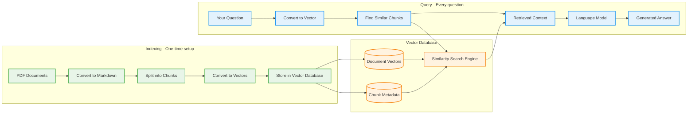

# RAG-Chat: Local Retrieval-Augmented Generation

A local RAG (Retrieval-Augmented Generation) system that helps you understand and query your PDF documents using locally-run language models through a focused interactive chat interface.

## How RAG Works

**Retrieval-Augmented Generation (RAG)** combines information retrieval with text generation to answer questions using your own documents as context.


```mermaid
flowchart LR
    subgraph INDEXING ["Indexing - One-time setup"]
        FILES[PDF Documents] --> MD[Convert to Markdown]
        MD --> CHUNK[Split into Chunks]
        CHUNK --> EMBED[Convert to Vectors]
        EMBED --> STORE[Store in Vector Database]
    end

    subgraph QUERY ["Query - Every question"]
        QUESTION[Your Question] --> QEMBED[Convert to Vector]
        QEMBED --> SEARCH[Find Similar Chunks]
        SEARCH --> CONTEXT[Retrieved Context]
        CONTEXT --> LLM[Language Model]
        LLM --> ANSWER[Generated Answer]
    end

    subgraph DATABASE ["Vector Database"]
        VECTORS[(Document Vectors)]
        METADATA[(Chunk Metadata)]
        SIMILARITY[Similarity Search Engine]
    end

    STORE --> VECTORS
    STORE --> METADATA
    VECTORS --> SIMILARITY
    METADATA --> SIMILARITY
    SEARCH --> SIMILARITY
    SIMILARITY --> CONTEXT

    %% Styling
    classDef indexPhase fill:#e8f5e8,stroke:#4caf50,stroke-width:2px
    classDef queryPhase fill:#e3f2fd,stroke:#2196f3,stroke-width:2px
    classDef dbPhase fill:#fff3e0,stroke:#f57c00,stroke-width:2px

    class FILES,MD,CHUNK,EMBED,STORE indexPhase
    class QUESTION,QEMBED,SEARCH,CONTEXT,LLM,ANSWER queryPhase
    class VECTORS,METADATA,SIMILARITY dbPhase
```

### Two-Phase Process

#### **Phase 1: Indexing (Setup)**

1. **Convert PDFs**: PDFs are converted to Markdown via `pymupdf4llm` (preserving tables, structure, etc.)
2. **Split Documents**: Break Markdown content into manageable chunks, respecting structural boundaries
3. **Create Embeddings**: Convert text chunks into numerical vectors using `qwen3-embedding:latest` via Ollama
4. **Store Vectors**: Save embeddings and metadata in a searchable ChromaDB vector database

#### **Phase 2: Querying (Every Question)**

1. **Embed Question**: Convert your question into the same vector format
2. **Find Similar**: Search database for chunks most similar to your question
3. **Retrieve Context**: Get the most relevant text chunks with their metadata
4. **Generate Answer**: Feed question + context to the LLM for a knowledgeable response

### System Components

| Component     | Purpose                        | Implementation                               |
| ------------- | ------------------------------ | -------------------------------------------- |
| **Indexer**   | Finds and converts PDF files   | `pymupdf4llm` → Markdown                     |
| **Chunker**   | Splits documents intelligently | Smart Markdown-aware chunker                 |
| **Embedder**  | Converts text to vectors       | `qwen3-embedding:latest` via Ollama          |
| **Database**  | Stores and searches vectors    | ChromaDB with cosine similarity              |
| **Generator** | Produces final answers         | `gpt-oss:latest` via Ollama (high reasoning) |

## Requirements

- Python 3.8+
- [Ollama](https://ollama.com) installed and running locally
- The following Ollama models pulled:

```bash
ollama pull qwen3-embedding:latest
ollama pull gpt-oss:latest
```

## Installation

1. Clone this repository.

2. Create and activate a virtual environment:

```bash
python -m venv .venv
source .venv/bin/activate
```

3. Install dependencies:

```bash
pip install -r requirements.txt
```

## Configuration

All settings are managed via `src/.env`. Key options:

| Variable                   | Default                  | Description                    |
| -------------------------- | ------------------------ | ------------------------------ |
| `EMBEDDINGS_MODEL_NAME`    | `qwen3-embedding:latest` | Ollama embedding model         |
| `LLM_MODEL_NAME`           | `gpt-oss:latest`         | Ollama LLM model               |
| `LLM_MAX_TOKENS`           | `2000`                   | Max tokens per response        |
| `CHUNK_SIZE`               | `1000`                   | Target chunk size (chars)      |
| `CHUNK_OVERLAP`            | `200`                    | Overlap between chunks (chars) |
| `N_RESULTS`                | `5`                      | Number of chunks to retrieve   |
| `SIMILARITY_THRESHOLD`     | `0.7`                    | Minimum similarity score       |
| `CHROMA_PERSIST_DIRECTORY` | `chroma_db`              | Path to ChromaDB storage       |

## Usage

### Indexing PDFs

```bash
python cli.py --index /path/to/your/pdf/folder
```

This will:

- Find all `.pdf` files recursively in the directory
- Convert each PDF to Markdown (preserving tables and structure)
- Split the Markdown into overlapping chunks
- Generate embeddings with `qwen3-embedding:latest`
- Store everything in the local ChromaDB database

### Querying

```bash
python cli.py --query "What are the key findings in these documents?"
```

This starts a focused chat session:

1. The initial query triggers a RAG search — the most relevant chunks are retrieved
2. A streaming response is generated using `gpt-oss:latest` with high reasoning effort
3. Follow-up questions reuse the initial context (no repeated retrieval) for faster responses
4. Conversation history is maintained throughout the session

Type `exit`, `quit`, or press Ctrl+C to end the session.
